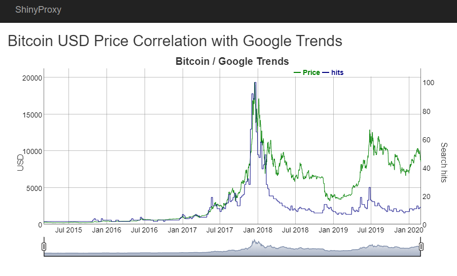
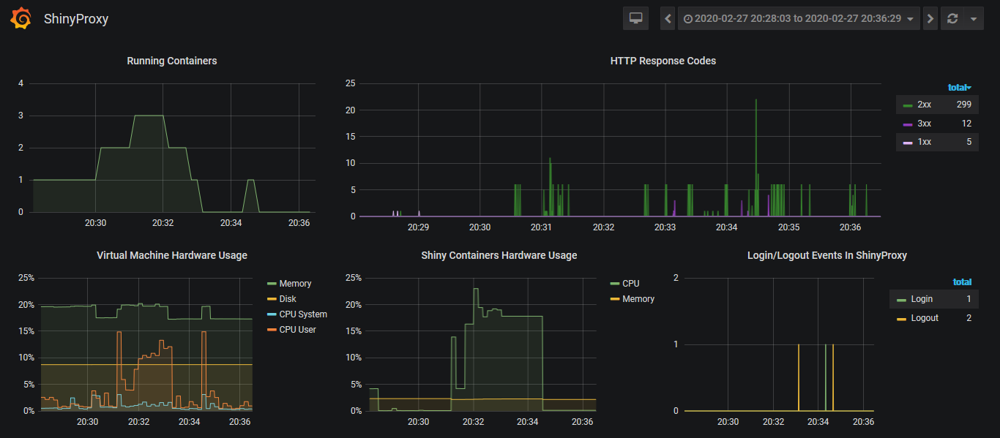

# Bitcoin Google Trends Correlation Chart
Shiny is an R package that makes it easy to build interactive web apps straight from R. Bitcoin is an innovative payment network and a new kind of money. In this project I've created shiny web app with chart presenting correlation between bitcoin value and google trends for **bitcoin** keyword. I've also included how to deploy infrastructure needed to run this application using terraform and ansible. 
App can be accessed after signing up in auth0 at:
> **https://btcgtrends.westeurope.cloudapp.azure.com/app/bitcoingoogletrends**

<p align="center">  </p>

## Tech stack

* Terraform 
* Ansible 
* Docker 
* [Azure DevOps](https://dev.azure.com/damianbudelewski/shinyapp/)
* Azure Container Registry
* InfluxDB/Telegraf/Grafana

## 

## Deployment

> **Note:**
>
> - Authentication to ARM is done using **azure cli** which authenticate terraform automaticly. If you want to provide authentication inside terraform template, you have to add provider section inside main.tf site.
> - Docker app image is stored on **private** Azure Container Registry. To recreate environment deployed with ansible, you have to create your own ACR or change playbook to use docker hub instead and push your image there.

### 1. Building application
Definition of Docker image is created in `app/Dockerfile`. To build this image run `docker build -t bitcoingoogletrends .` inside app folder. In this project I've configured pipeline for building this app. Every change on app folder, triggers build of docker image on Azure DevOps platform, and after successful build, image is deployed to Azure Container Registry `shinyappsacr.azurecr.io/bitcoingoogletrends:TAG`. Definition of azure pipeline is stored in  `azure-pipelines.yml` file.

### 2. Creating infrastructure 
Inside terraform directory, initialize project with `terraform init` cmd and if you will see information similar to this `Terraform has been successfully initialized!` you can move on. Create execution plan with `terraform plan` command. After a while you should see quite big output containing every resource that is planned to be deployed. In our case it's 9 resources. Last what we have to do is to apply this plan with `terraform apply`. After successful deployment you should get public ip address and fqdn name of created virtual machine.

```bash
Apply complete! Resources: 9 added, 0 changed, 0 destroyed.

Outputs:

public_ip_address = **********
fqdn = ************
```

### 3. Provisioning and application deployment
This step is fully automated with ansible playbooks. First define variables in `hosts.yml` file. Public ip and fqdn you can get from terraform output or terraform.state file. If it's done just run `ansible-playbook -i hosts.yml deploy.yml` inside ansible directory. Then try to access website with provided fqdn.


## Example monitoring with Grafana
> **https://btcgtrends.westeurope.cloudapp.azure.com/grafana**



## TODO
- [x] Ansible role for nginx deployment
- [ ] Configure terraform to parse output variables into ansible vars file.
- [x] Create Azure DevOps pipeline for building app and deploying image to ACR.
- [x] Configure Auth0.
- [x] Nginx SSL Proxy.
- [ ] Add Terraform remote state storage on Azure.
- [x] Add influxdb/grafana containers to collect and display metrics from shinyproxy

## Links
* [Shiny proxy getting started documentation](https://www.shinyproxy.io/getting-started/)
* [Example of VM deployment using terraform](https://docs.microsoft.com/en-us/azure/terraform/terraform-create-complete-vm)
* [Terraform variables introduction](https://upcloud.com/community/tutorials/terraform-variables/)
